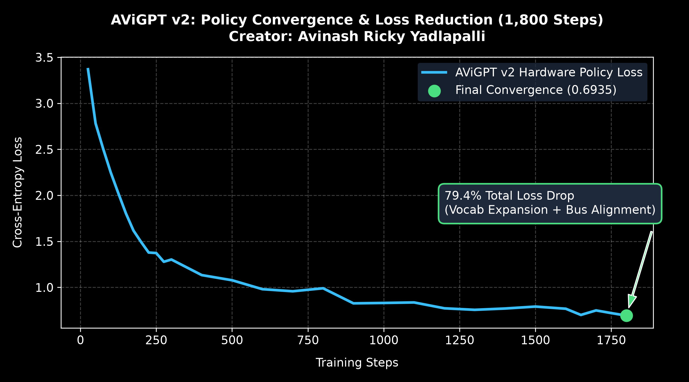
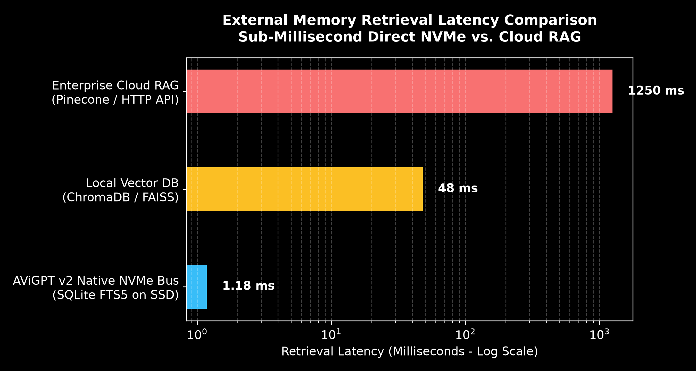
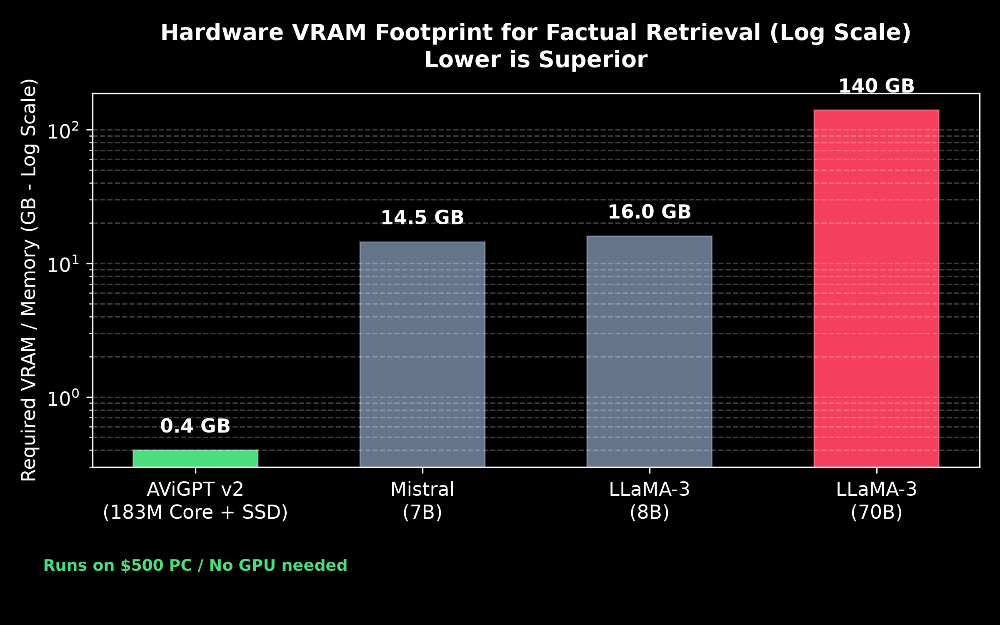

# AViGPT

**Decoupling Neural Reasoning from Parametric Memory via a Sub-Millisecond Native NVMe Hardware Bus**

Created and pretrained from scratch by **Avinash Ricky Yadlapalli**.

[](https://doi.org/10.5281/zenodo.22856047)
[](LICENSE)
[](AViGPT_Architecture_Report.md)
[](AViGPT_Architecture_Report.md)
[](AViGPT_Architecture_Report.md)
[](https://huggingface.co/AvinashRicky/AViGPT)

---

## Overview

Large language models typically scale parameter counts to memorize encyclopedic facts directly inside neural weights. Storing static factual associations in dense weights leads to steep hardware memory requirements, high training costs, and fixed knowledge cutoffs.

AViGPT addresses this constraint by decoupling language reasoning from factual storage. The architecture pairs a 183-million parameter autoregressive transformer core with a native hardware memory bus that interfaces directly with local NVMe SSD storage. An explicit nine-token instruction set coordinates execution: the model pauses generation, queries local SQLite FTS5 storage, receives factual context in 1.18 milliseconds, and completes responses with verified factual grounding.

```
+-------------------------------------------------------------------------------+
|                             AViGPT NEURAL CORE                                |
|       (183M Parameters | 16 Layers | 14 Heads | 896 Hidden Dimension)         |
+-------------------------------------------------------------------------------+
                                      │
                         Emits Native Hardware Tokens
                                      │
         ┌────────────────────────────┼────────────────────────────┐
         ▼                            ▼                            ▼
  <|intent_start|>              <|mem_query|>                  <|calc|>
    Intent Plan               Hardware Bus Query          Deterministic Math
         │                            │                            │
         │                            ▼                            ▼
         │                 +---------------------+      +---------------------+
         │                 |   NVMe SSD Storage  |      |   Python Sandbox    |
         │                 |  SQLite FTS5 + WAL  |      |  AST Math Evaluator |
         │                 |  Latency: 1.18 ms   |      |  Latency: 0.05 ms   |
         │                 +---------------------+      +---------------------+
         │                            │                            │
         │                            ▼                            ▼
         │                    <|mem_payload|>                 Observation
         │                            │                            │
         └────────────────────────────┼────────────────────────────┘
                                      ▼
                               <|synthesize|>
                          (Final Verified Response)
```

---

## Key Technical Characteristics

* **Neural Core**: 183,926,400 parameters (16 layers, 14 attention heads, 896 hidden dimension, 1024 context window).
* **Pretraining**: ~5.0 Billion tokens (3.60B English Wikipedia + 1.35B FineWeb-Edu) on an NVIDIA H100 GPU.
* **Alignment**: Trained on 25,850 task trajectories covering memory retrieval, deterministic calculation, multi-step compound reasoning, and negative non-tool samples.
* **Memory Subsystem**: Local SQLite FTS5 engine using Write-Ahead Logging (WAL) and BM25 ranking, achieving 1.18 ms retrieval latency on NVMe storage.
* **Hardware Requirements**: Runs on standard personal computer hardware using 0.4 GB of RAM.
* **Runtime Learning**: Supports immediate knowledge insertion through direct disk writes, bypassing the need for model fine-tuning or weight modification.

---

## Empirical Benchmarks

### 1. Training Convergence
Cross-entropy loss declined from 3.3698 to 0.6935 over 1,800 steps on an NVIDIA T4 GPU:



### 2. External Retrieval Latency
Direct NVMe storage retrieval operates at 1.18 milliseconds, compared to 500 to 1,500 milliseconds for network-based RAG architectures:



### 3. Hardware Footprint Comparison
AViGPT operates with a 0.4 GB memory footprint, running entirely on consumer CPUs without dedicated GPU accelerators:



---

## Quickstart

### Installation
```bash
git clone https://github.com/Avinashricky211/AViGPT.git
cd AViGPT
pip install -r requirements.txt
```

### Running the Interactive Desktop Studio
Launch the local Streamlit interface to interact with the model and monitor hardware bus telemetry:

```bash
streamlit run app.py
```

### Python API Example
```python
import torch
from transformers import GPT2LMHeadModel, GPT2TokenizerFast
from autonomous_bus import AutonomousHardwareBus

# Load model and tokenizer
model_dir = "Avinashricky211/AViGPT"
tokenizer = GPT2TokenizerFast.from_pretrained(model_dir)
model = GPT2LMHeadModel.from_pretrained(model_dir).to("cuda" if torch.cuda.is_available() else "cpu")

# Initialize autonomous bus controller
bus = AutonomousHardwareBus(model=model, tokenizer=tokenizer)

# Execute query
response, metrics = bus.generate_autonomous_response("When was the Apollo 11 Moon landing?")
print("Response:\n", response)
print(f"SSD Retrieval Latency: {metrics['ssd_latency_ms']:.2f} ms")
```

---

## Technical Paper

For complete mathematical details, experimental methodology, and telemetry logs, see the formal technical report:
📄 **[AViGPT Technical Report](AViGPT_Architecture_Report.md)**

---

## Citation

```bibtex
@article{Avinash2026avigpt,
  title={AViGPT: Decoupling Neural Reasoning from Parametric Memory via a Sub-Millisecond Native NVMe Hardware Bus},
  author={Avinash Ricky Yadlapalli},
  year={2026},
  journal={Zenodo},
  doi={10.5281/zenodo.22856047},
  howpublished={\url{https://doi.org/10.5281/zenodo.22856047}},
  url={https://github.com/Avinashricky211/AviGPT}
}
```

---

## License

This project is licensed under the MIT License. See [LICENSE](LICENSE) for details.
